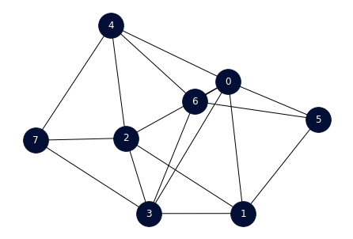
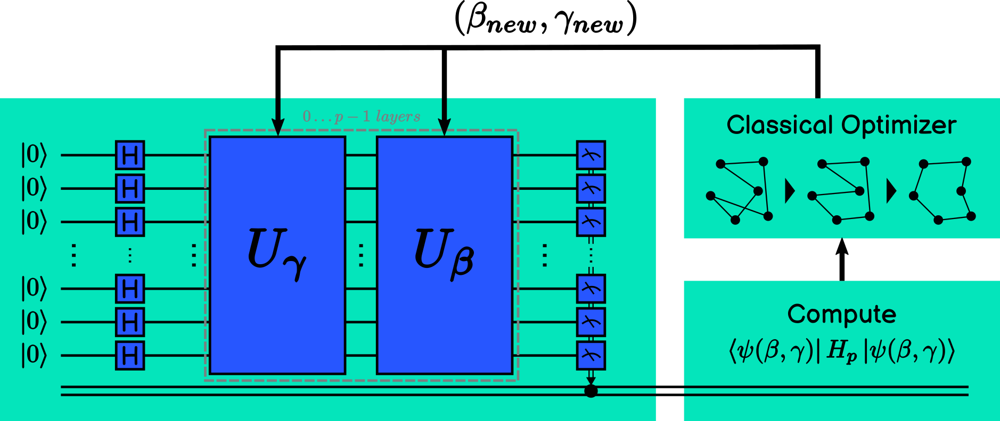
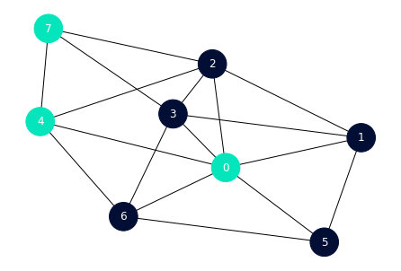
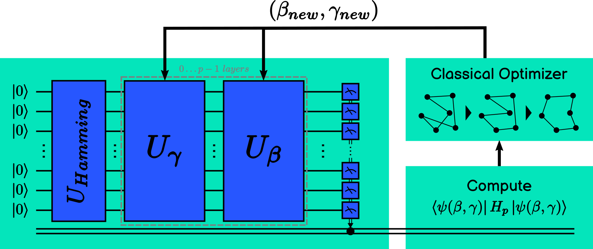
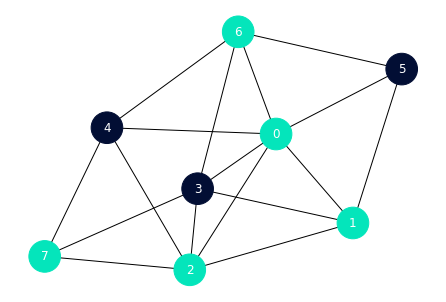

# Introducing Neighborhood Quantum Superposition

Neighborhood Quantum Superposition is a groundbreaking product designed to enhance quantum algorithms, for example, optimization problems. By leveraging the power of superpositions over a subset of all possible states, this innovative approach significantly improves the efficiency of quantum algorithms.

## Problem Scenario: MaxCut Optimization

Let's consider the MaxCut optimization problem, a classic challenge in combinatorial optimization. We'll showcase the effectiveness of Neighborhood Quantum Superposition by comparing the results obtained using the Quantum Approximate Optimization Algorithm (QAOA) with and without our product. The problem is:

  

### QAOA Standard Approach

In the standard QAOA implementation [1], we apply the algorithm to solve the MaxCut problem. The results demonstrate a certain number of iterations needed to reach a satisfactory solution. The scheme and the process is:

  

| Iter | β                       | γ                      | f(X)                   |
|------|-------------------------|------------------------|------------------------|
|   1  | 2.0000000000000000000  | 1.0000000000000000000 | -8.3798828125000000000 |
|   2  | 1.0000000000000000000  | 2.0000000000000000000 | -8.5537109375000000000 |
|   3  | 0.0023082574778608977  | 0.9320942793047758412 | -8.4560546875000000000 |
|   4  | 0.5011541287389305044  | 0.9660471396523879761 | -8.4101562500000000000 |
|   5  | 1.2497960306482607251  | 0.9899033137924772019 | -8.5693359375000000000 |
|   6  | 1.2447476875444993816  | 0.8650052984683468393 | -8.4970703125000000000 |
|   7  | 1.2649530363447807346  | 1.2394434211466172080 | -8.5771484375000000000 |
|   8  | 1.3138162974235862990  | 1.3544972421033523169 | -8.3906250000000000000 |
|   9  | 1.1402379668271600544  | 1.2478785521601236663 | -8.5029296875000000000 |
|  10  | 1.2806268212534932527  | 1.1789406735508640711 | -8.6181640625000000000 |
|  11  | 1.3258589049967741680  | 1.1358093786451830542 | -8.5781250000000000000 |
|  12  | 1.2268525022396148394  | 1.1470883170510126625 | -8.6357421875000000000 |
|  13  | 1.1748765968830285900  | 1.1817979016403330483 | -8.5419921875000000000 |
|  14  | 1.2384333991035596512  | 1.1180634083030653869 | -8.6777343750000000000 |
|  15  | 1.2483890147595890774  | 1.0884416558750029669 | -8.6796875000000000000 |
|  16  | 1.2335781385455577563  | 1.0834638480469882538 | -8.6396484375000000000 |
|  17  | 1.2782447080649084192  | 1.0976720446673948750 | -8.6923828125000000000 |
|  18  | 1.3090386083722886923  | 1.1029916502786332178 | -8.6640625000000000000 |
|  19  | 1.2936416582185985558  | 1.1003318474730139354 | -8.6796875000000000000 |
|  20  | 1.2795746094677180604  | 1.0899735695905496957 | -8.6777343750000000000 |
|  21  | 1.2696822491404056166  | 1.1107420455153751426 | -8.6640625000000000000 |
|  22  | 1.2769629603502241633  | 1.0899654060326915417 | -8.6923828125000000000 |
|  23  | 1.2820980273822599749  | 1.0970311708100528580 | -8.6982421875000000000 |
|  24  | 1.2859513466996115305  | 1.0963902969527108411 | -8.6865234375000000000 |
|  25  | 1.2824184643109310944  | 1.0989578304687286359 | -8.7050781250000000000 |
|  26  | 1.2845254171744682203  | 1.1022471371879831725 | -8.6767578125000000000 |
|  27  | 1.2805501508513663644  | 1.0995271301107754081 | -8.6884765625000000000 |
|  28  | 1.2833746194771686877  | 1.0991564295988456301 | -8.6992187500000000000 |
|  29  | 1.2824177600535693333  | 1.0984695497266108166 | -8.7021484375000000000 |
|  30  | 1.2820399356100622423  | 1.0992662694444113036 | -8.7011718750000000000 |
|  31  | 1.2826456460531900916  | 1.0990472346115833790 | -8.7050781250000000000 |
|  32  | 1.2823818443740178097  | 1.0990508841103578952 | -8.7031250000000000000 |
|  33  | 1.2823719374901163537  | 1.0989395205002721045 | -8.7031250000000000000 |
|  34  | 1.2825180709518797517  | 1.0989489694823890709 | -8.7050781250000000000 |
|  35  | 1.2825180709518797517  | 1.0989489694823890709 | -8.7050781250000000000 |

As we can see, after 35 iterations we obtain the solution **01101110(110)** with a value **-9**:

  

### QAOA with Neighborhood Quantum Superposition

Now, let's introduce Neighborhood Quantum Superposition into the QAOA algorithm. By applying superpositions over a carefully selected subset of states (Hamming distance from 11110000 state and a range between 1 and 3), our product modifies the initial state preparation and the mixing operator. The modification of the QAOA algorithm is based on [3]. The new process followed by the new approach is:

  

| Iter | β                       | γ                      | f(X)                   |
|------|-------------------------|------------------------|------------------------|
|   1  | 2.0000000000000000000  | 1.0000000000000000000 | -8.4804687500000000000 |
|   2  | 2.0000000000000000000  | 2.0000000000000000000 | -8.5751953125000000000 |
|   3  | 2.2864415830283810749  | 2.9580977087501021394 | -8.9091796875000000000 |
|   4  | 3.2802766092080459792  | 3.0689667339034998328 | -8.1894531250000000000 |
|   5  | 1.4828130141758624205  | 3.5532288903597137875 | -7.7441406250000000000 |
|   6  | 2.7858259276802366244  | 2.9332929447593549810 | -7.8964843750000000000 |
|   7  | 2.1833688341620942630  | 2.7303346554663279200 | -8.1416015625000000000 |
|   8  | 2.1869291680773867981  | 3.1874386760250770223 | -7.9248046875000000000 |
|   9  | 2.4111969196087446043  | 2.9502806764027091901 | -8.5830078125000000000 |
|  10  | 2.2572670270558572447  | 3.0133706251179406266 | -9.2060546875000000000 |
|  11  | 2.2262856966417148286  | 3.0676514427773100557 | -9.0742187500000000000 |
|  12  | 2.2296305688719377791  | 2.9987833471316789336 | -9.1718750000000000000 |
|  13  | 2.2412392061625410200  | 3.0737805494467442813 | -9.0449218750000000000 |
|  14  | 2.2492531166091991324  | 3.0435755872823424539 | -9.1757812500000000000 |
|  15  | 2.2718643991945550731  | 3.0077977128053015043 | -9.1435546875000000000 |
|  16  | 2.2501652325062102555  | 3.0101149116132535077 | -9.2128906250000000000 |
|  17  | 2.2456760158085162793  | 3.0165088219732090202 | -9.2207031250000000000 |
|  18  | 2.2383220526057168165  | 3.0191459380991823025 | -9.2763671875000000000 |
|  19  | 2.2315461426992291294  | 3.0152572106480537428 | -9.2255859375000000000 |
|  20  | 2.2378950521567873011  | 3.0230287798007089428 | -9.2812500000000000000 |
|  21  | 2.2397619783129316673  | 3.0236026125229624739 | -9.2832031250000000000 |
|  22  | 2.2406079953470197097  | 3.0253629966979818100 | -9.2900390625000000000 |
|  23  | 2.2405229117846139353  | 3.0273142675794928458 | -9.2871093750000000000 |
|  24  | 2.2415794621315030533  | 3.0252633643585924439 | -9.2890625000000000000 |
|  25  | 2.2405407628613693838  | 3.0258466271064290432 | -9.2822265625000000000 |
|  26  | 2.2405292662982665419  | 3.0248811042660181947 | -9.2812500000000000000 |
|  27  | 2.2408521348629668601  | 3.0253622608117951565 | -9.2910156250000000000 |
|  28  | 2.2408766917547491282  | 3.0252653228983352740 | -9.2919921875000000000 |
|  29  | 2.2409168207689478258  | 3.0251737277990153885 | -9.2910156250000000000 |
|  30  | 2.2409251607114790694  | 3.0252776013442264080 | -9.2919921875000000000 |
|  31  | 2.2409012486465313962  | 3.0251683849848753916 | -9.2910156250000000000 |
|  32  | 2.2409012486465313962  | 3.0251683849848753916 | -9.2910156250000000000 |

As we can see, after 32 iterations we obtain the solution **00111000(56)** with a value **-12**:

  

## Results and Implications

The results speak for themselves. With Neighborhood Quantum Superposition, the MaxCut problem is solved with increased efficiency. Fewer iterations are required, leading to faster convergence, and the algorithm consistently reaches better solutions.

This is a very simple use case, the parts of the algorithm where one can investigate and reduce the algorithm's complexity are:

- Number of **layers** of the algorithm.
- Number of **shots**.
- The **metric** used.
- The **problem domain size**.
- The **mixing operator**.
- The **heuristic** for the reference state.

## Investment Opportunity

Investing in Neighborhood Quantum Superposition opens the door to revolutionary advancements in quantum algorithm performance. As demonstrated in the MaxCut optimization example, our product has the potential to significantly reduce computational resources while enhancing the quality of solutions. We provide the tools, you create the magic. Unlock the limitless potential of our product to elevate your ideas to new heights.

For more details, visit [QSimov](https://qsimov-cloud-client.readthedocs.io/en/latest/).

## References

[1] Farhi, Edward, Jeffrey Goldstone, and Sam Gutmann. ["A quantum approximate optimization algorithm"][qaoa]. *arXiv preprint* arXiv:1411.4028 (2014). 

[2] Qiskit Community Tutorials. ["Solving Combinatorial Optimization Problems using QAOA"][qaoa-tutorial].

[3] Bartschi, A., & Eidenbenz, S. (2020, October). ["Grover Mixers for QAOA: Shifting Complexity from Mixer Design to State Preparation"][gm-qaoa]. In 2020 IEEE International Conference on Quantum Computing and Engineering (QCE) (pp. 1-10). IEEE. DOI: 10.1109/qce49297.2020.00020 

[qaoa]: https://arxiv.org/abs/1411.4028
[qaoa-tutorial]: https://learn.qiskit.org/course/ch-applications/solving-combinatorial-optimization-problems-using-qaoa
[gm-qaoa]: https://arxiv.org/abs/2006.00354
